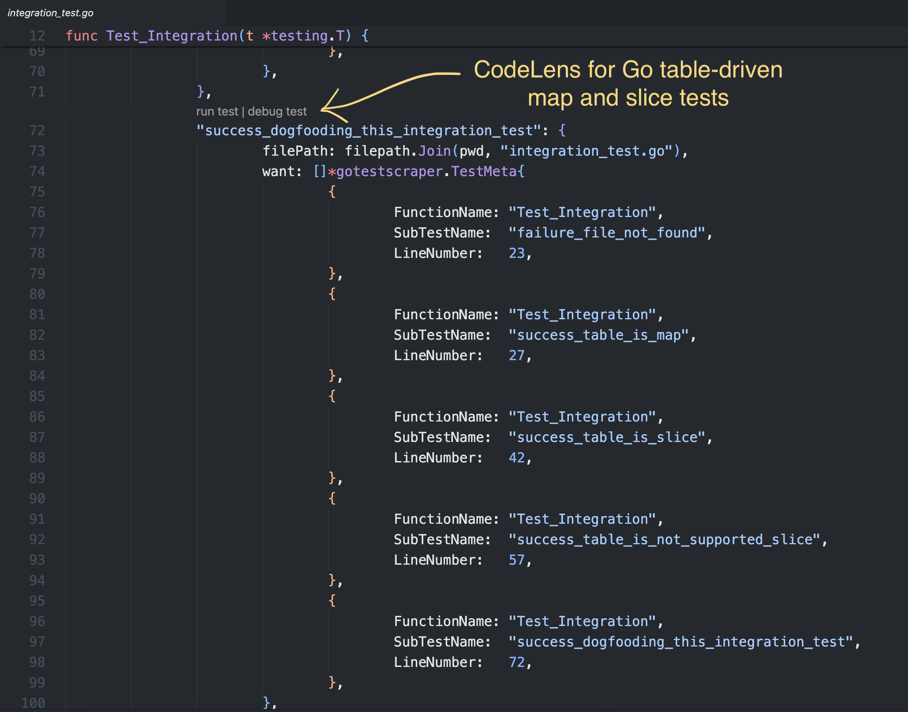

# Go Test CodeLens - Enhanced

A VS Code extension that enhances the Go testing experience by providing CodeLens support for running and debugging table-driven tests directly from your editor.

## Features

### CodeLens Support
- **Table-Driven Tests**: Special support for Go's table-driven test pattern
  - Run or debug individual test cases that are defined in a slice or map

### How It Works
1. Open any Go test file (*_test.go)
1. Find any slice- or map-based table-driven tests
1. Look for the `Run test | Debug test` CodeLens above the test name
1. Click the one you want to do, celebrate! 🎉

## Requirements

This extension requires the [Go for Visual Studio Code](https://marketplace.visualstudio.com/items?itemName=golang.Go) extension to be installed.

## Future Enhancements

- Integration with VS Code's Test Explorer for a more native test running experience

## Installation

You can install from [here](https://marketplace.visualstudio.com/items?itemName=timweightman.go-test-codelens-enhanced).

## Credits
Based on the work of [takaaa220](https://github.com/takaaa220/test_name_finder)

## License

[Apache License Version 2.0](../LICENSE)
